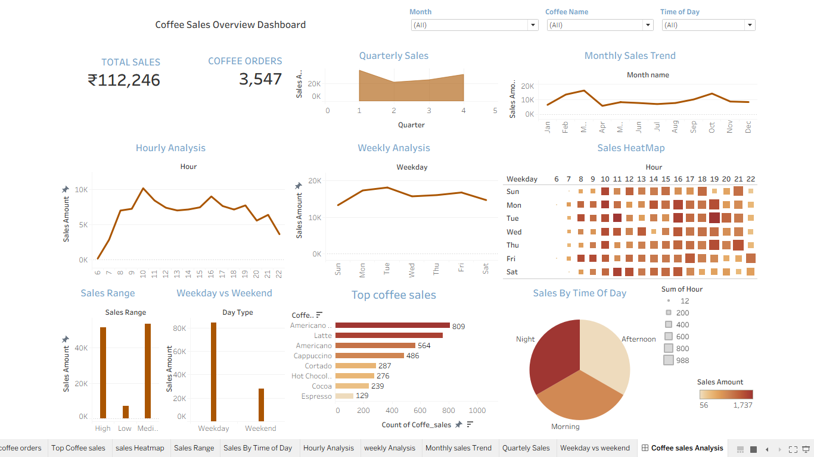

# ☕ Coffee Sales Analytics Dashboard
## Overview
This project presents an interactive Tableau dashboard for analyzing coffee shop sales performance, customer purchasing behavior, and product trends using Excel data.

## Project Objective
To analyze coffee sales data and provide interactive insights into revenue, customer demand, product performance, and sales trends using Tableau.

## Tech Stack
- Microsoft Excel --Data cleaning & preparation
- Tableau         --Dashboard development & Visualization

## Dataset
Coffee sales dataset containing transaction details, products, quantity, date, and revenue.

## Dashboard Features
- Total Sales KPI
- Total Orders KPI
- Monthly Sales Trend
- Quarterly Sales Analysis
- Hourly Sales Analysis
- Weekly Sales Analysis
- Sales Heatmap
- Top Selling Products
- Weekday vs Weekend Sales
- Time of Day Analysis
- Interactive Filters (Month, Coffee Name, Time of Day)

## Key Insights
- Total Revenue: ₹112K+
- Total Orders: 3,547
- Identified peak sales hours.
- Analyzed top-selling coffee products.
- Compared weekday and weekend sales performance.

## Dashboard Preview

## Conclusion
This dashboard helps analyze sales performance, identify peak demand periods, compare weekday and weekend sales, and evaluate product performance through interactive visualizations.

